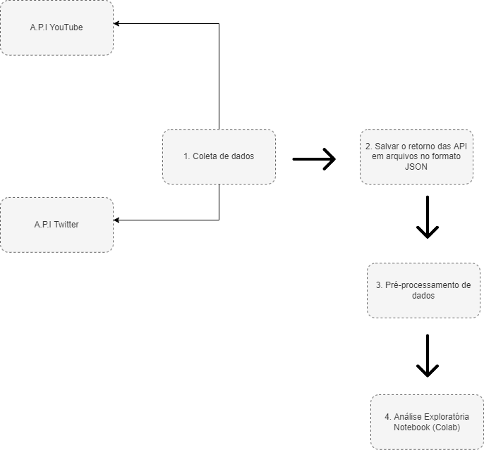
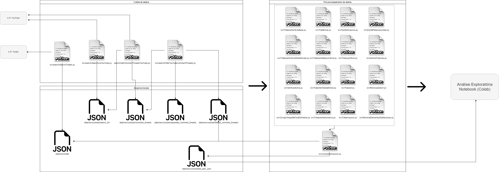

# Resumo
As redes sociais têm uma grande relevância em nossa vida cotidiana, sendo por consequência foco de discussões e de opinião sobre várias empresas, órgãos e entidades públicas e/ou privadas, a explosão das redes sociais de internet e sua aplicação como ferramentas de transmissão de imagem empresarial, marketing e meio de relacionamento entre as instituições e seus clientes, mostra como o poder das redes sociais e sua influência política tem grande poder em relação com o uso de dados gerados por seus usuários (Menezes, 2017). Nesse panorama e incluindo a pandemia mundial de COVID-19, cumprindo o objetivo deste Trabalho de Conclusão de Curso (TCC), criamos um aplicativo para analisar os resultados de algumas ferramentas de redes sociais, tendo como referência o papel do SUS (Sistema Único de Saúde). A metodologia envolve os processos de extração de dados das redes sociais utilizadas, Twitter e YouTube. Os dados foram coletados, processados e classificados, em positivos, negativos e neutros, através de várias técnicas de processamento de linguagem natural e sintetizadas em visualizações para um entendimento melhor dos padrões. Os resultados alcançados foram o processamento textual para classificação de comentários utilizando TextBlob, análise baseada em léxico, Vader e LeIA a partir dessa rotulação foram gerados visualizações comparativas utilizando WordCloud e Gráfico de frequência.

# Abstract

Social networks are of great importance in our daily lives, and are therefore the focus of discussions and opinions on various companies, bodies and public and/or private entities, the dissemination of social networks and their application as tools for transmitting corporate image policy, marketing and means of relationship between institutions and their customers, as the power of social networks and their influence has great relation to the use of data generated by their users (Menezes, 2017). Within this panorama and including the global pandemic of COVID-19 and the Brazilian health scenario. The Single Health System was the focus of the spotlight. It is of immense importance to analyze social media to understand the role of the SUS in acting in the pandemic scenario. The social networks used to collect the comment data were Twitter and YouTube, the data were collected, pre-processed, classified, in positive, negative and neutral, through various natural language process techniques and synthesized in visualizations for a better understanding of data. The results achieved were the textual processing for classification of comments using TextBlob, analysis based on lexicon, Vader and LeIA from this labeling comparative views were generated using WordCloud and Frequency chart.

O escopo deste trabalho trata da coleta, processamento e análise de dados referente aos termos SUS e COVID 19, a partir das plataformas Twitter e Youtube, segue abaixo um croqui da implementação do pipeline:

Figura 1 - Pipeline resumido.

Fonte: criado por este autor.

Figura 2 - Pipeline detalhado.

Fonte: criado por este autor.

A coleta de dados na rede social Twitter pode ser feita por meio de API, Interface de Programação de Aplicativos. Para isso, é necessário criar uma conta e configurar para consumir os dados da Interface de Programação de Aplicativos, doravante API.
Ao configurar corretamente, conforme a documentação, adquirimos as chaves para poder acessar a API, são elas consumer key, consumer secret, access token e access token secret elas serão utilizadas para pegar os tweets e as informações que desejarmos.

# Conclusão:

Portanto, conclui-se que, o processamento textual é difícil, pois não existem variações na língua, ambiguidade, formatações para data, hora e etc de formas diferentes e existem muitas formas de expressões que necessitam de tratamento para poder utilizar os dados dentro das ferramentas disponíveis em PNL. Além de ser significativamente oneroso, pois as próprias técnicas para processamento de linguagem natural já demandam bastante uso computacional e este trabalho propôs fazer várias formas de visualizações diferentes para quem for utilizá-lo com o mesmo recorte de dados ou coletar dados diferentes e/ou formatar dados já coletados para poder utilizar a ferramenta, pudesse ter formas de chegar em suas próprias conclusões sobre o resultado da classificação de sentimentos e as nuances de cada classificador aqui proposto.
Outro experimento foi verificar que a Análise de Sentimentos baseada em léxico é um ótimo caminho para iniciar uma Análise de Sentimentos, pois sua performance é bem otimizada e o dicionário de palavras positivas e negativas são customizáveis, por conseguinte palavras mais comuns de um contexto específico podem ser utilizadas servindo para comparativos com outras técnicas/ferramentas de Análise de Sentimentos.

Figura 31 - Classificação TextBlob, análise baseada em léxico, Vader, LeIA.

Fonte: criado por este autor.

A biblioteca LeIA apesar de ser baseada na biblioteca Vader, o texto foi traduzido automaticamente, através da API do google, portanto, a tradução poderia gerar uma variação na Análise de Sentimentos, entretanto isso não ocorreu para o recorte de dados aqui utilizado.

# Referências:

API Reference | YouTube Data API | Google Developers. Último acesso em 01/11/2022 às 09:53.

Conheça o Colab, disponível em: https://colab.research.google.com/notebooks/intro.ipynb?hl=pt_BR. Último acesso em: 02/11/2022 às 22:28.

Código SQL com todas as cidades e estados do Brasil, disponível em: https://zerobugs.com.br/ver-post/codigo-sql-com-todas-as-cidades-e-estados-do-brasil-62/. Último acesso em: 02/11/2022 às 22:51.

Demoji, disponível em: https://github.com/bsolomon1124/demoji/blob/master/README.md. Último acesso em: 02/11/2022 às 22:28.

Developer Platform, disponível em: https://developer.twitter.com/. Último acesso em: 02/11/2022 às 22:26.

Google API Client Library for Python, disponível em: https://pypi.org/project/google-api-python-client/. Último acesso em: 02/11/2022 às 22:26.

HALLIDAY, M. A. K.; MATTHIESSEN, C. M. I. M. Halliday's Introduction to Functional Grammar. 3. ed. Hodder Education, 2004.

Instalando módulos Python, disponível em: https://docs.python.org/pt-br/3/installing/index.html. Último acesso em: 02/11/2022 às 22:27.

JACOBSON, D. BRAIL, G. WOODS, D. et al. APIs: A Strategy Guide: Creating Channels with Application Programming Interfaces. 1 ed. Sebastopol, CA: O'Reilly Media, 2011, E-book Kindle.

KNAFLIC, C. N. Storytelling com dados. 1 ed. Rio de janeiro: Alta books, 2019.

LIU, B. Sentiment analysis and subjectivity. In: INDURKHYA, N.; DAMERAU, F. Handbook of Natural Language Processing. 2. ed. [Londres]: Chapman and Hall/CRC, 2010. p. 1-38. Disponível em: https://www.cs.uic.edu/~liub/FBS/NLP-handbook-sentiment- analysis.pdf. Acesso em: 30 maio 2020.

LIU, B. Sentiment Analysis: Mining Opinions, Sentiments, and Emotions (Studies in Natural Language Processing). 2 ed. Cambridge, Reino Unido: Cambridge University Press, 2020, E-book Kindle.

MANOVICH, L. THE PRACTICE OF EVERYDAY (MEDIA) LIFE, 2008. p. 1-18. Disponível em: https://www.digitalartarchive.at/fileadmin/user_upload/Virtualart/PDF/146_56_article_2008.pdf. Acesso em: 18 setembro 2022.

MARQUESONE, R. Big Data, Técnicas e tecnologias para extração de valor dos dados. 1 ed. São Paulo: Casa do Código, 2016, E-book.

MENEZES, Adriano Paulino. Realização de negócios bancários nas redes sociais: o atendimento a clientes do Banco do Brasil via Facebook. 2017. 88 f. Dissertação (Mestrado em Comunicação) – Universidade Católica de Brasília, Brasília-DF, 2017.

MITCHELL, Ryan. Web Scraping com Python: Coletando mais dados da web moderna. 2 ed. São Paulo: Novatec, 2019, E-book Kindle.

PAIM, S. J. O Que É o Sus. São Paulo: SciELO - Editora FIOCRUZ, 2009, E-Book Kindle.
Provost, Foster. Fawcett, Tom. Data Science para Negócios. 1 ed. Rio de Janeiro: Alta Books, 2016.

Palavras positivas, disponível em: https://www.dicio.com.br/palavras-positivas/. Último acesso em: 02/11/2022 às 22:28.

Practical Natural Language Processing, disponível em: https://github.com/practical-nlp/practical-nlp-code/blob/master/Ch8/O5_smtd_preprocessing.py. Último acesso em: 02/11/2022 às 22:27.

Python Software Foundation. Documentação Python 3.9.1 [online], disponível em: https://docs.python.org/pt-br/3/. Último acesso em: 07/08/2022 às 13:26.

Python Twitter Tools, disponível em: https://pypi.org/project/twitter/. Último acesso em 01/12/2022 às 11:58.

RECUERO, R.; BASTOS, M.; ZAGO, G. Análise de Redes para Mídia Social. Porto Alegre: Sulina, 2020.

Regex101: Remove url links. regex101, disponível em: https://regex101.com/r/hG9t0Q/1. Último acesso, 31/07/2022 às 19:25.

Regular Expressions, disponível em: https://regex101.com/r/cRGVvH/1. Último acesso em: 02/11/2022 às 22:27.

Regular Expressions, disponível em: https://regex101.com/r/bXWUPM/4/. Último acesso em: 02/11/2022 às 22:27.

RUSSEL, M. A. Mineração de Dados da Web Social. 1 ed. São Paulo: Novatec, 2011.

SAKTHIVEL, S. SENTIMENT ANALYSIS: SENTIMENT CLASSIFICATION BY ADAPTING MULTIPLE DOMAINS, 2019.

SINGH, A. Processamento de linguagem natural com Python: simplesmente em profundidade. 1 ed. Madrid: Babelcube Inc, 2021.
Twitter library for Python, disponível em: https://pypi.org/project/tweepy/. Último acesso em: 02/11/2022 às 22:27.

VADER-Sentiment-Analysis, disponível em: https://github.com/cjhutto/vaderSentiment. Último acesso em: 02/11/2022 às 22:28.

VAJJALA, S. et al. Practical Natural Language Processing. 1 ed. Sebastopol: O'Reilly Media, 2020.

Wikipédia Palavra negativa, disponível em: https://pt.wikipedia.org/wiki/Palavra_negativa. Último acesso em: 02/11/2022 às 22:28.

YouTube Data API, disponível em: https://developers.google.com/youtube/v3. Último acesso em: 02/11/2022 às 22:26.
